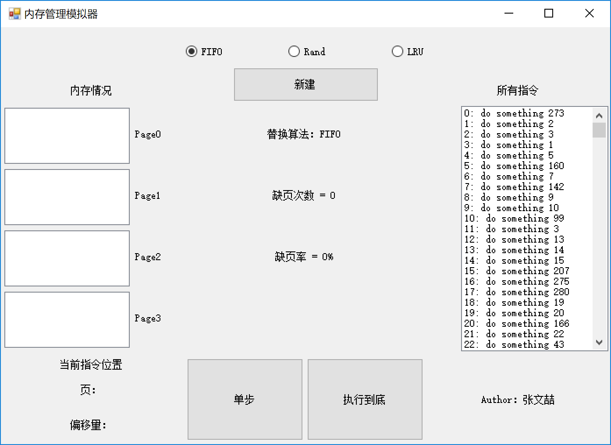
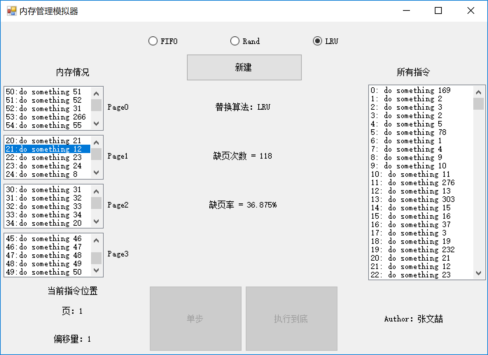
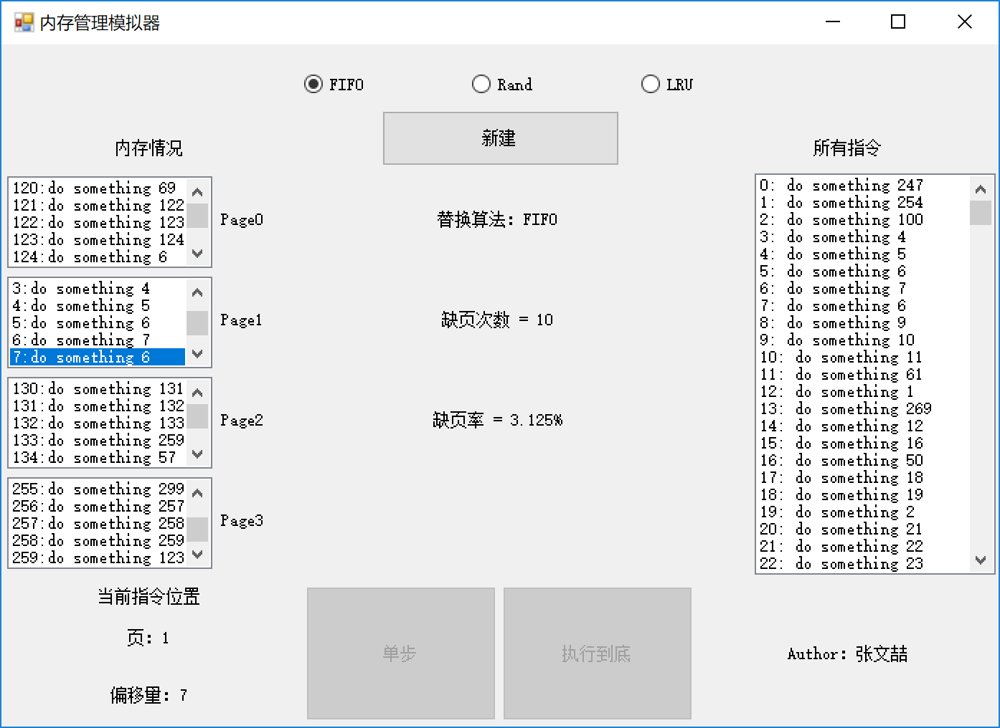
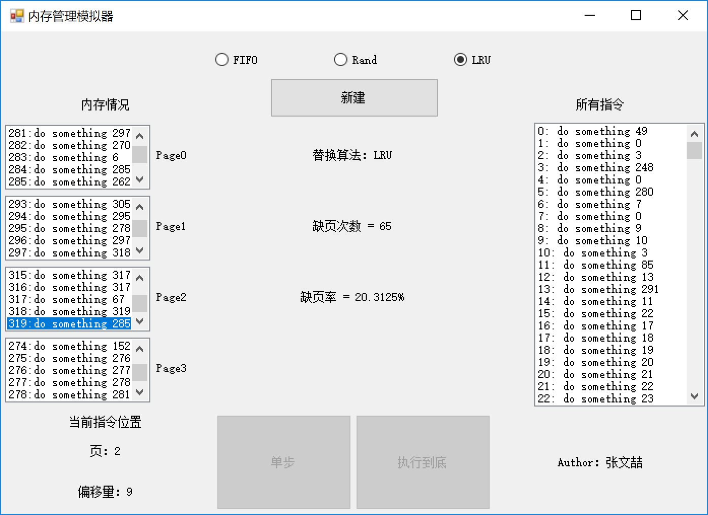

# 内存管理之页替换算法

操作系统 课程作业2

#### Author：张文喆 1551719

## 项目背景

1. 共有320条指令
2. 一个页可以存放10条指令
3. 共有4个内存块，每个内存块可存放一个页
4. 50%的指令为顺序执行指令，25%的指令为前地址指令，25%的指令为后地址指令
5. 当要执行的指令不在内存中时，即触发页调换操作

## 开发/运行环境

- 开发环境：Windows10 Pro 1803
- 开发语言：C# 6.0/ .net Framework 4.7.03056
- 开发工具：Microsoft Visual Studio Community 2017

## 使用说明



上图是我设计的GUI界面，下面分块介绍每一部分的作用

1. 单选按钮

   单选按钮用于选择页替换算法，有三种替换算法可供选择：FIFO算法，随机算法和LRU算法。

2. “新建”按钮

   此按钮用于刷新所有统计数据，生成新的指令序列。

3. 内存情况

   左侧的四个列表框用于显示四个内存块的内部装载的指令情况。

4. 所有指令

   右侧的列表框展示所有的指令。

5. “单步”按钮

   这个按钮用于单步执行指令，可以通过高亮和右下的指令区详细地看到内存块中指令地执行情况。

6. “执行到底”按钮

   这个按钮用于执行320条指令，可以直接在中央地结果区看到最终的运行结果。

## 指令结构

```c#
public struct Ins
        {
            public int pos;  // 指令序号
            public string content;  // 指令内容
            public int nextPos;  // 下一条指令地址
        }
```

我使用结构体来表示指令，每个指令包含三部分结构：

1. pos：指令序号，范围为0~319，同时被用作指令的地址
2. content：指令内容，没有实际用到
3. nextPos：下一条指令的地址，范围为0~319

## 页结构

```c#
public class Page  // 页对象
        {
            public int inTime;  // 记录页调入的时间，越大表示距离当前越近
            public int lastUseTime;  // 记录最后一次使用的时间，越大表示距离当前越近
            public int startPos;
            private Dictionary<int, Ins> page = new Dictionary<int, Ins>();  // 页
    		// 省略函数
        }
```

为了实现FIFO算法，我在页对象中添加了inTime变量作为页调入的时间，这个变量的值与调入此页时执行过的指令数量相等，所以inTime的值越大，表明此页的调入时间越晚。

为了实现LRU算法，我在页对象中添加了lastUseTime作为页最后一次被使用的时间，这个变量的值与最后一次执行此页上的指令时执行过的指令数量相等，所以lastUseTime的值越大，表明最后一次访问此页的时间越近。

startPos是此页中第一条指令的起始地址（即指令序号），因为一个页中包含10条指令，所以可以根据这个值和偏移量定位到页内的任一条指令。

字典型变量page用于记录业内的每一条指令，其键值对形式为<页内偏移量，指令>。

## 页目录结构

```c#
public static Dictionary<int, Page> Contents = new Dictionary<int, Page>();
```

页目录Contents是一个字典型变量，其键值对形式为<内存块标号，页对象>。其中，内存块序号为0，1，2，3.

## 指令执行流程

1. 根据全局变量nextInsPos的值，在内存中查找对应指令
2. 根据查找结果的不同，有两种情况：
   1. 在某个内存块中查找到了相应指令，更新各项数据
   2. 未在内存中找到相应指令，进行页替换，更新各项数据
3. 置nextInsPos的值为此指令的下一条指令地址
4. 重复以上步骤，直到执行320条指令

显然，根据这个流程，虽然我们生成了320条指令，但并不能保证每一条指令都能被执行到，因为我们生成的跳转地址都是随机的。

## 替换算法实现

1. FIFO

   ```c#
   public int FIFO()
           {
               int newestTime = 320;
               int currentPos = 0;
               foreach(KeyValuePair<int, Page> kvp in Contents)
               {
                   if (kvp.Value.inTime < newestTime)  // 选出最早进入的页
                   {
                       newestTime = kvp.Value.inTime;
                       currentPos = kvp.Key;
                   }
               }
   
               return currentPos;
           }
   ```

   根据页对象的inTime成员变量选出最早进入的页，并将其换出。这里只展示了找到这个被换出的页的过程，具体替换过程略去不表。

2. Rand

   ```c#
   public int Rand()
           {
               Random rd = new Random();
               return rd.Next(0, 4);
           }
   ```

   返回一个随机的内存块的标号，进行替换。

3. LRU

   ```c#
   public int LRU()
           {
               int newestTime = 320;
               int currentPos = 0;
               foreach (KeyValuePair<int, Page> kvp in Contents)
               {
                   if (kvp.Value.lastUseTime < newestTime)  // 选出最远被访问的页
                   {
                       newestTime = kvp.Value.lastUseTime;
                       currentPos = kvp.Key;
                   }
               }
   
               return currentPos;
           }
   ```

   与FIFO结构近似，只是用于判断的变量变成了lastUseTime。

## 存在的问题

由于随机生成的指令序列太过于随机，不具有正确的指令序列的各种特点，也不符合程序的局部性原理，所以在模拟执行过程中会出现以下或更多问题：

1. 在一些情况下，由于跳转指令的频繁出现，一个内存块中的指令执行1~3条后，即跳转到其它页中的指令，使得缺页频率很高；而且一个页在被访问一次（执行其中的几条指令）后，很难再被访问第二次，这就使得LRU算法的性能大大下降（几乎违背了LRU算法的前提假设）。综合以上两点，使用FIFO算法和LRU算法的运行结果完全一致。**这并不是算法实现错误，而是指令序列的随机性问题**。

   

   

2. 由于指令序列的随机性，在执行指令时可能会陷入死循环。举例来说，指令A指向指令B，指令B指向指令C，指令C指向指令A。当通过其它途径执行到指令A\B\C中的任一个时，都会导致死循环，此时缺页率格外低，可以通过单步执行指令观察到这一现象。

   

   请注意蓝色高亮的部分，6、7号指令构成了一个死循环。如此执行320条指令，会使缺页率降到很低的水平。

## 较理想的结果

1. FIFO

   

2. Rand

   

3. LRU

   

   

   |        |   FIFO   |   Rand   |   LRU    |
   | :----: | :------: | :------: | :------: |
   | 缺页率 | 32.1875% | 17.8125% | 20.3125% |

   